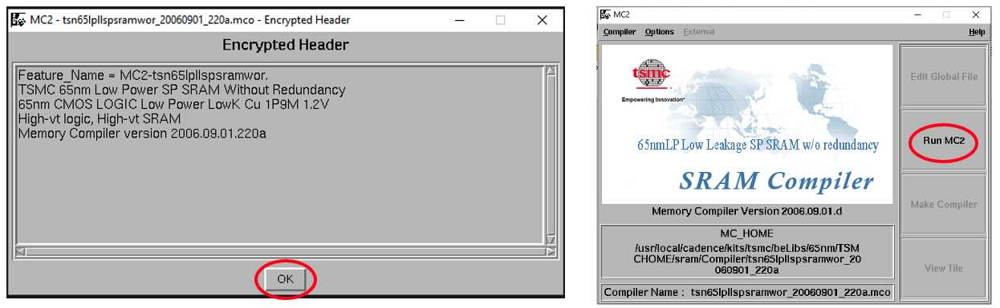

##### Imperial College London, Department of Electrical & Electronic Engineering


#### ELEC70142 Digital VLSI Design

### Lab 3 - Memory and Self-test

##### *Peter Cheung, v1.0 - 12 October 2025*

---
### Objectives
---
By the end of this laboratory session, you should be able to do the following.
* Use TSMC's memory compiler tool to generate efficient memory.
* Integrate a block of logic implement using standard cells with generated memory.
* Verify that the entire system works properly using built-in self-test.

---
### Task 1 - Generate 32 x 32 SRAM 
---


**_Step 1: Launch the memory compiler

* Create a new directory for this lab, say, LAB_3 and change to that directory.
* Launch TSMC's pdk with:
  ``` bash
  pdk TSMC65LP
  ```
* Launch TSMC's **Memory Compiler** with:
``` bash
tsmcmemcomp spsram
```
>The argument **_spsram_** generates a single port RAM with a write port with its own write address and data input, and one read port with its own read address and data out.
>The argument **_dpsram_** generatess a dual port RAM with a single write port (own addresa and data), and two separate read ports.

* Clck **_OK_** and **_Run MC2__** in the pop-up windows.


<p align="center">  </p><BR>
